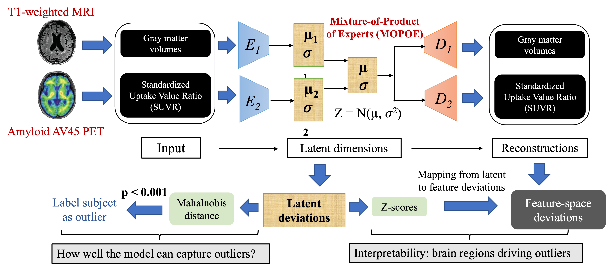
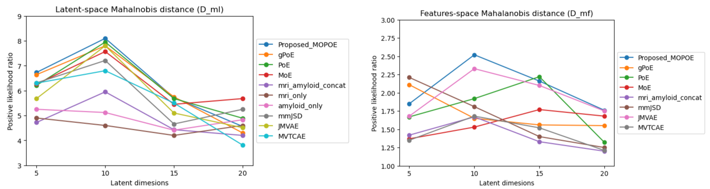
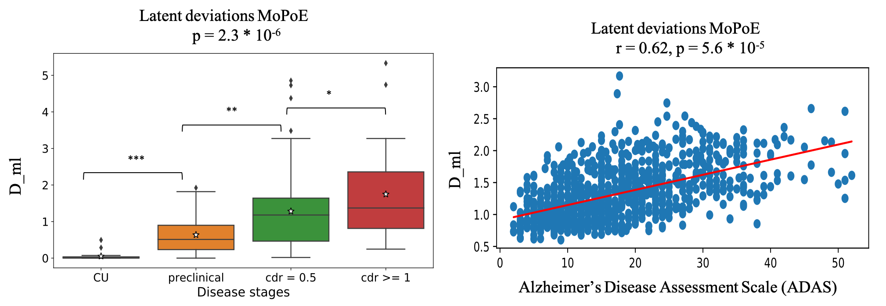
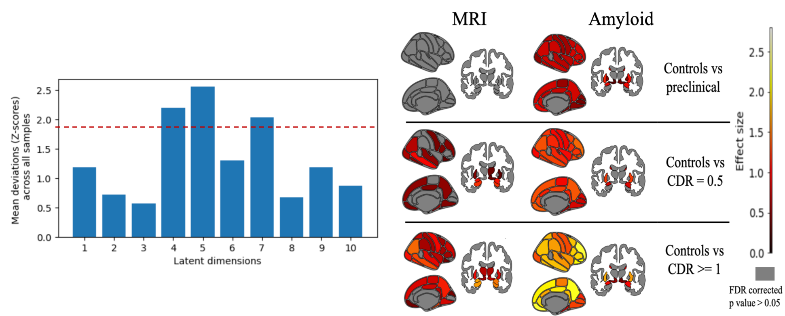

# Overview
This repository contains official implementation for our paper titled "Improving Normative Modeling for Multi-modal Neuroimaging Data using mixture-of-product-of-experts variational autoencoders", accepted in IEEE International Symposium in Biomedical Imaging (IEEE ISBI 2024). [[ArXiV](https://arxiv.org/pdf/2312.00992.pdf)]

 

Figure 1:  Proposed MoPoE normative modelling framework

## Abstract

Normative models in neuroimaging learn the brain patterns of healthy population distribution and estimate how disease subjects like Alzheimer's Disease (AD) deviate from the norm. Existing variational autoencoder (VAE)-based normative models using multimodal neuroimaging data aggregate information from multiple modalities by estimating product or averaging of unimodal latent posteriors. This can often lead to uninformative joint latent distributions which affects the estimation of subject-level deviations. In this work, we addressed the prior limitations by adopting the Mixture-of-Product-of-Experts (MoPoE) technique which allows better modelling of the joint latent posterior. Our model labelled subjects as outliers by calculating deviations from the multimodal latent space. Further, we identified which latent dimensions and brain regions were associated with abnormal deviations due to AD pathology.with patient cognition and result in higher number of brain regions with statistically significant deviations compared to the unimodal baseline model.

# Implementation details

## Environment & Packages

We recommend an environment with python >= 3.7 and pytorch >= 1.10.2, and then install the following dependencies:
```
pip install -r requirements.txt
```
All models were implemented using the multi-view-AE package developed by Aguila, Ana Lawry, et al [Multi-view-AE: A Python package for multi-view autoencoder models](https://joss.theoj.org/papers/10.21105/joss.05093). The source code of the paper can be found in the folder named multi-view-AE.

Cortical and subcortical brain atlases were visualized using the ggseg package. The original R implementation can be found [here](https://github.com/ggseg/ggseg). A more recent Python implementation can also be found [here](https://github.com/ggseg/python-ggseg).

## Datasets & Feature extraction

### Datasets

We used the ADNI dataset in our study. ADNI data are available through an access procedure described at [http://adni.loni.usc.edu/data-samples/access-data/](http://adni.loni.usc.edu/data-samples/access-data/).

### Feature extraction

We used preprocessed regional brain volumes extracted from T1-weighted MRI scans and regional Standardized Uptake Value Ratio (SUVR) values extracted from AV45 Amyloid PET scans as the two input modalities for our model (Figure 1). For both T1-weighted MRI and and AV45 Amyloid scans, the cortical surface of each hemisphere was parcellated according to the Desikan–Killiany atlas and anatomical volumetric measures were obtained via a whole-brain segmentation procedure. The final data included cortical regions(32 per hemisphere) and 24 subcortical regions (12 per hemisphere). 

**ATN_data_extraction.py** and **ADNI_fine_tuning.py** scripts implement the complete feature extraction process including preparing data for training and evaluation.

## Model training

- **dataloaders.py** - Dataloader functions for train, test and validation splits
  
- **multimodal_VAE.py** - Implements the architecture for mmVAE MOPOE including the modality-specific encoders and decoders, Product-of-Experts (PoE), and multimodal ELBO loss functions
  
- **training.py** - Training all models including proposed method and baselines as shown in Table 1. Model configurations for multimodal and unimodal VAEs are available in the configs folder.

All models were trained using Adam optimizer with hyperparameters as follows: epochs = 500, learning rate = 10^−5, batch size = 64 and latent dimensions in the range [5,10,15,20]. The encoder and decoder networks have 2 fully-connected layers of sizes 64, 32 and 32, 64 respectively.

## Performance evaluation

- Evaluating outlier detection performance (likelihood ratio) - **sig_ratio.py**
    
- Clinical validation of latent deviations - **clinical_validation.py**
  
- Interpretability analysis - **interpretability.py**

 

Fig 1. Likelihood ratio calculated for D~ml~ (multimodal latent deviations) and D~mf~ (multimodal feature deviations)

 

Fig. 2. **Left**: Box plot showing the latent deviations D~ml~ across cognitively unimpaired (CU) subjects and the AD groups (in order of severity). Statistical annotations: ns: not significant, 0.05 < p <= 1: *,0.01 < p <= 0.05: **, 0.001 < p < 0.01: ***, p < 0.001. **Right**: Association between Dml and cognition scores (ADAS). Each point in the plot represents a subject and the red line denotes the linear regression fit of the points, adjusted by age and sex.

 

Fig 3. **Left**: Latent dimensions (4,5 and 7) with statistically significant deviations (mean absolute Z~ml~ > 1.96 or p < 0.05). The dotted red line indicates Z > 1.96. Latent dimensions above the dotted line were used for mapping to feature-space deviations. **Right**: Effect size maps showing the region-level pairwise group differences in Zmf between control subjects and each of the AD stages for both the modalities. The color bar represents the Cohen’s d statistic effect size (0.5 is considered a small effect, 1.5 a medium effect and 2.5 a large effect). Gray regions represent that no participants have statistically significant deviations after False Discovery Rate (FDR) correction.


## Acknowledgement

The preparation of this report was supported by the Centene Corporation contract (P19-00559) for the Washington University-Centene ARCH Personalized Medicine Initiative and the National Institutes of Health (NIH) (R01-AG067103). Computations were performed using the facilities of the Washington University Research Computing and Informatics Facility, which were partially funded by NIH grants S10OD025200, 1S10RR022984-01A1 and 1S10OD018091-01. Additional support is provided The McDonnell Center for Systems Neuroscience
  
## Citation
If you find our work is useful in your research, please consider raising a star  :star:  and citing:

```
@article{kumar2023improving,
  title={Improving Normative Modeling for Multi-modal Neuroimaging Data using mixture-of-product-of-experts variational autoencoders},
  author={Kumar, Sayantan and Payne, Philip and Sotiras, Aristeidis},
  journal={arXiv preprint arXiv:2312.00992},
  year={2023}
}

